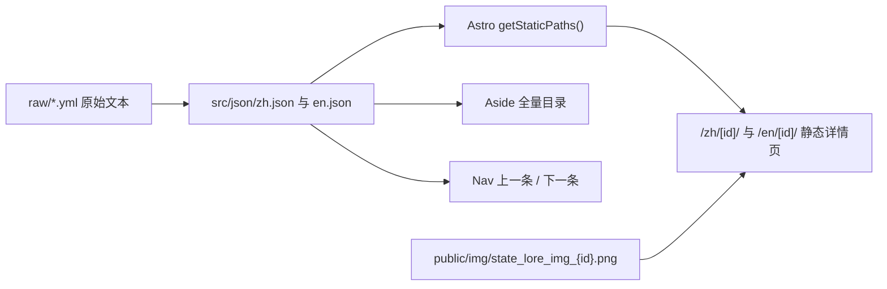

# Astro TNO 项目介绍

## 项目概览

**Astro TNO** 是一个以 _The New Order: Last Days of Europe_ 世界观城市档案为主题的静态内容站点。项目基于 Astro 构建，面向 GitHub Pages 静态部署，核心目标不是做一个复杂后台系统，而是通过真实内容、真实素材和完整页面链路，练习现代静态页面创作、数据驱动页面生成、多语言内容组织，以及具有强风格化表达的 CSS 视觉设计。

这个项目由作者主导架构设计，在 AI 辅助下完成开发。它既是一个面向展示的非官方爱好者项目，也是一个前端学习项目：通过把游戏模组中的城市文本、图片素材和双语内容整理为可浏览的静态站点，系统练习 Astro、Tailwind CSS、静态路由生成、国际化路由、页面组件拆分、内容数据建模和整体视觉调校。

项目线上站点配置为：

- 站点域名：`https://aaarynt.github.io`
- 部署路径：`/Astro-TNO/`
- 默认语言：简体中文
- 支持语言：`zh`、`en`
- 输出模式：静态站点

## 创作目标

本项目的主要目标可以概括为四类：

1. **练习静态页面创作**

   项目将 TNO 城市档案做成可直接浏览的静态站点，而不是停留在数据文件或 README 目录。首页、About 页面、详情页、侧边栏、上一条/下一条导航、语言切换、移动端侧栏开关等都被实现为完整页面体验。

2. **练习数据驱动页面生成**

   站点的详情页不是手写 550 个页面，而是通过 `src/json/zh.json` 和 `src/json/en.json` 中的数据生成。Astro 的 `getStaticPaths()` 会读取 JSON 数组，为每个城市条目生成独立静态路由。这使项目从一开始就具备内容规模化能力。

3. **学习最新前端技术栈**

   项目使用 Astro 6、Tailwind CSS 4、Vite 插件式 Tailwind 集成、严格 TypeScript 配置、Prettier、Stylelint、Husky、lint-staged、GitHub Actions 和 GitHub Pages。这些工具覆盖了从开发、格式化、类型约束到部署自动化的完整前端工作流。

4. **优化 CSS 样式与主题表现**

   项目不是普通文档站，而是尝试把 TNO 世界观的冷战、档案、终端、军事情报感转译为网页视觉语言。深色背景、扫描线纹理、青绿色发光文字、自定义字体、游戏风格鼠标指针、紧凑边框、暗色排版和高对比色强调，共同形成了高度主题化的页面风格。

## 内容主题

站点名称为 **The New Order Cities Archive**，中文可理解为 **TNO 城市档案馆**。

内容基于 _The New Order: Last Days of Europe_ 模组的城市背景介绍，当前 README 中标注的来源版本为模组版本 `v1.9.0`。项目收录该世界观中的重要城市、港口、殖民地、边缘地区和南极基地等条目。每个条目通常包含：

- 城市或地点 ID
- 城市简称或初始代号
- 当前语言下的城市名称
- 当前语言下的背景描述
- 与 ID 对应的城市横幅图

内容气质上，它不是地理百科式的中立介绍，而是更接近 TNO 世界观中的“档案摘录”：通过城市的历史、权力结构、殖民关系、战争创伤、经济功能和社会状态，展示一个架空冷战世界中的秩序裂缝。

## 技术栈

项目当前使用的主要技术如下：

| 类型          | 技术                                                               |
| ------------- | ------------------------------------------------------------------ |
| 页面框架      | Astro `^6.1.8`                                                     |
| CSS 框架      | Tailwind CSS `^4.2.4`                                              |
| Tailwind 集成 | `@tailwindcss/vite`                                                |
| 排版插件      | `@tailwindcss/typography`                                          |
| 图片处理相关  | `sharp`                                                            |
| 包管理        | pnpm                                                               |
| 代码格式化    | Prettier 3、`prettier-plugin-astro`、`prettier-plugin-tailwindcss` |
| CSS 检查      | Stylelint 17、`stylelint-config-standard`                          |
| Git Hook      | Husky、lint-staged                                                 |
| 部署          | GitHub Actions + GitHub Pages                                      |
| 类型配置      | Astro strict TypeScript config                                     |

`package.json` 要求 Node.js 版本不低于 `22.12.0`。GitHub Actions 中部署环境使用 Node 24 和 pnpm 9。

## 目录结构

项目的主要目录如下：

```text
.
├── src/
│   ├── pages/
│   │   ├── index.astro
│   │   ├── zh/
│   │   │   ├── index.astro
│   │   │   ├── About.astro
│   │   │   └── [id].astro
│   │   └── en/
│   │       ├── index.astro
│   │       ├── About.astro
│   │       └── [id].astro
│   ├── layouts/
│   │   ├── Layout.astro
│   │   ├── Header.astro
│   │   └── Aside.astro
│   ├── components/
│   │   ├── Nav.astro
│   │   ├── Footer.astro
│   │   └── svg/
│   ├── json/
│   │   ├── zh.json
│   │   └── en.json
│   ├── styles/
│   │   └── global.css
│   └── tailwind.config.ts
├── public/
│   ├── img/
│   ├── img/winter/
│   ├── font/
│   ├── cursor/
│   ├── The_New_Order_Logo.png
│   ├── TNOpediA_Logo.png
│   └── favicon.svg
├── raw/
│   ├── TNO_state_lore_l_simp_chinese.yml
│   ├── TNO_state_lore_l_english.yml
│   └── images/
├── .github/
│   ├── workflows/deploy.yml
│   └── dependabot.yml
├── README.md
├── README_zh.md
├── astro.config.mjs
├── package.json
├── pnpm-lock.yaml
├── stylelint.config.mjs
└── tokei.yaml
```

整体结构比较清晰：`src` 负责页面、布局、组件、样式和结构化数据；`public` 负责运行时可直接访问的静态资源；`raw` 保留原始模组文本和 DDS 图片素材；`.github` 负责依赖更新和部署流水线。

## 页面架构

项目页面可以分为四类。

### 根路由

`src/pages/index.astro` 很轻量，只做一件事：把访问根路径的用户重定向到英文首页：

```astro
return Astro.redirect('/Astro-TNO/en/', 302)
```

这说明项目虽然配置了中文为默认语言，但根路径策略当前选择跳转到英文入口。

### 双语首页

首页分别位于：

- `src/pages/zh/index.astro`
- `src/pages/en/index.astro`

两个首页结构基本一致，差异主要是文案语言和按钮文本。首页负责建立项目气质：

- 展示 _The New Order_ Logo
- 链接到 Steam Workshop 模组页面
- 呈现 `CLASSIFIED ARCHIVE · 1962` 的档案感标语
- 用短篇引导文字解释世界观背景
- 提供“进入档案 / Enter Archives”入口
- 提供 About 页面入口
- 使用 `Footer` 组件展示 TYPE、SOURCE、STATUS 等元信息

首页没有做成泛用落地页，而是直接作为主题化档案入口存在，符合这个项目“静态内容展陈”的定位。

### About 页面

About 页面分别位于：

- `src/pages/zh/About.astro`
- `src/pages/en/About.astro`

它们提供更长的世界观介绍。中文 About 页面围绕 1962 年的 TNO 世界格局展开：德意志、日本、美国、地中海世界、俄罗斯等区域的权力状态，被组织成一篇具有叙事感的背景说明。英文 About 页面承担相同的信息和氛围功能。

About 页面使用 `prose prose-invert tno-prose` 组合，将 Tailwind Typography 的文章排版能力与项目自定义暗色主题结合起来。

### 动态详情页

详情页分别位于：

- `src/pages/zh/[id].astro`
- `src/pages/en/[id].astro`

这是项目最核心的页面。它们通过 Astro 动态路由生成所有城市详情页。每个页面包含：

- 城市名称
- 城市横幅图片
- 城市背景描述
- 左侧全量条目导航
- 上一条 / 下一条切换

详情页的关键逻辑是：

1. 从对应语言 JSON 中读取所有条目。
2. `getStaticPaths()` 把每个条目的 `id` 映射为静态路由。
3. 当前条目作为 `props.item` 传入页面。
4. 页面根据 `item.id` 拼出图片地址。
5. 页面根据 `item.desc.default` 生成段落。
6. `Nav` 组件根据当前条目在数组中的位置生成上一条和下一条。

这让项目可以稳定承载大量静态内容，而不需要维护大量重复页面文件。

## 数据模型

中英文 JSON 文件结构一致：

- `src/json/zh.json`
- `src/json/en.json`

当前每种语言各有 **550 条**城市档案数据。中英文条目 ID 顺序一致，便于语言切换和页面生成。

一个典型条目结构如下：

```json
{
  "id": 1,
  "initials": "GER",
  "name": {
    "default": "日耳曼尼亚"
  },
  "desc": {
    "default": "世界之都日耳曼尼亚表面看起来是元首的光辉杰作..."
  }
}
```

当前数据 ID 覆盖范围为：

```text
1-237, 301-351, 353-600, 990-1003
```

这种 ID 分布保留了原始模组数据的编号体系，而不是为了网页展示重新连续编号。这样做的好处是可以降低与原始数据对照、更新和补丁同步时的认知成本。

## 数据驱动渲染流程

项目的数据渲染可以概括为：



项目中保留了 `raw/TNO_state_lore_l_simp_chinese.yml` 和 `raw/TNO_state_lore_l_english.yml`，说明 JSON 数据不是凭空编写，而是从模组本地化文本整理而来。`raw/images` 下保留 DDS 源素材，`public/img` 下则放置浏览器可直接访问的 PNG 图片。

这种分层方式适合静态站：

- `raw` 保存来源和可追溯性。
- `src/json` 保存页面生成所需的结构化数据。
- `public/img` 保存部署后直接访问的图片资源。
- `src/pages/[id].astro` 只关心如何把数据渲染为页面。

## 国际化设计

Astro 配置中启用了 i18n：

```js
i18n: {
  locales: ['zh', 'en'],
  defaultLocale: 'zh',
  routing: {
    prefixDefaultLocale: true,
  },
}
```

这意味着中文和英文路径都会显式带语言前缀，例如：

- `/Astro-TNO/zh/1/`
- `/Astro-TNO/en/1/`

项目没有把语言文案抽象成一个复杂 i18n 字典，而是采用更直接的结构：

- 中文页面读取 `zh.json`
- 英文页面读取 `en.json`
- 首页和 About 页面分别维护对应语言版本
- 共用布局组件根据当前路径或 `Astro.currentLocale` 判断语言

这种方案对于小型到中型静态内容站是务实的：结构直观，调试简单，页面文案可以独立打磨；代价是中英文页面存在一定重复代码。

`Header.astro` 中的语言切换逻辑会读取当前路径，切换语言时保留当前条目的后续路径。例如用户在 `/Astro-TNO/zh/25/`，切换到 English 后会跳到 `/Astro-TNO/en/25/`。这对双语条目浏览非常重要。

## 组件设计

项目组件拆分不复杂，但边界清晰。

### `Layout.astro`

详情页通用布局。它负责：

- 引入全局样式
- 渲染顶部 Header
- 渲染移动端侧边栏按钮
- 渲染遮罩层
- 渲染 Aside
- 提供默认内容插槽
- 管理移动端侧边栏开合脚本

这个布局主要服务详情页，因为详情页需要左侧目录和内容区域组合。

### `Header.astro`

顶部栏组件。它负责：

- HOME 链接
- GitHub 链接
- 语言切换选择框
- TNOpediA 图标链接
- 根据当前路径判断语言
- 切换语言时保持页面路径

Header 让用户可以在档案站、GitHub 项目和 TNOpediA 之间快速跳转。

### `Aside.astro`

左侧目录组件。它负责：

- 根据当前语言选择 `zh.json` 或 `en.json`
- 渲染所有城市条目列表
- 高亮当前 ID
- 使用 `getRelativeLocaleUrl()` 生成语言相关链接
- 在桌面端固定显示，在移动端通过按钮呼出
- 使用 `sessionStorage` 记录滚动位置
- 监听 Astro 页面切换事件，在导航后恢复侧栏滚动位置

滚动位置恢复是一个很实用的细节。由于条目数量很大，用户如果浏览到目录中部或后部，再进入详情页后如果侧栏回到顶部，会非常影响体验。这里的脚本提升了长目录浏览的连续性。

### `Nav.astro`

详情页底部的上一条 / 下一条导航。它通过当前条目在 JSON 数组中的位置找到前后条目，并使用取模逻辑实现首尾循环：

- 第一条的上一条是最后一条
- 最后一条的下一条是第一条

这种导航适合档案式连续阅读。

### `Footer.astro`

首页底部的小型信息块组件。它接收一个数组并渲染为多列网格，用于展示 TYPE、SOURCE、STATUS 等项目元信息。组件很轻量，但可以减少首页重复结构。

### SVG 组件

`src/components/svg` 下将 GitHub、语言、播放、左右箭头等图标封装为 Astro 组件，避免在页面里重复粘贴 SVG。对于这种静态站，组件化 SVG 足够轻量，也不会引入额外图标库体积。

## 文本标记解析

TNO 原始文本中存在类似 `§R...§!` 和 `§Y...§!` 的颜色标记。详情页中实现了一个轻量解析器：

- `§R...§!` 映射为 `text-red-400`
- `§Y...§!` 映射为 `text-yellow-400`

解析函数会把一段文本切分为普通文本和带颜色 class 的片段，再在 Astro 模板中渲染为 `<span>`。这比直接 `set:html` 更安全，也更贴合组件化渲染思路。

当前解析逻辑只处理 `R` 和 `Y` 两类标记。对于现有数据来说，这已经覆盖了项目实际使用到的强调色场景；如果后续从模组文本中引入更多颜色标记，可以继续扩展 `COLOR_CLASS_BY_TAG`。

## 样式系统

项目样式由 Tailwind 工具类和 `src/styles/global.css` 共同承担。

### Tailwind 的作用

页面结构主要通过 Tailwind class 完成，例如：

- 弹性布局：`flex`、`flex-col`、`items-center`
- 尺寸约束：`max-w-3xl`、`w-full`
- 响应式：`md:text-4xl`、`md:w-52`
- 边框和间距：`border`、`gap-8`、`px-4`
- 状态样式：`hover:text-shadow-[0_0_3px]`
- 深色排版：`prose prose-invert`

这种方式让页面样式与结构贴得很近，适合单人主导的小型静态站快速迭代。

### 全局 CSS 的作用

`global.css` 负责那些不适合完全写在 class 中的全局风格：

- 引入 Tailwind
- 启用 Tailwind Typography 插件
- 定义自定义字体 `Aldrich` 和 `fzrzhm`
- 自定义滚动条颜色
- 设置全站字体栈
- 设置扫描线式暗色背景
- 设置游戏风格鼠标指针
- 定义 `.nav-item`
- 定义 `.tno-prose`
- 定义 `.tno-quote`

尤其是背景、字体、鼠标指针和 `tno-prose`，共同决定了这个项目的强主题化视觉风格。

### 视觉风格关键词

项目当前视觉风格可以概括为：

- 冷色
- 暗色
- 档案感
- 军事终端感
- 低饱和灰雾文本
- 青绿色强调
- 细边框信息块
- 文本发光
- 扫描线背景
- 自定义游戏鼠标
- 长文阅读优先

这种风格与 TNO 的世界观主题相匹配，也能体现作者在 CSS 氛围塑造上的练习方向。

## 静态资源组织

`public` 目录中主要包含：

- TNO Logo
- TNOpediA Logo
- favicon
- 自定义字体
- 自定义鼠标指针
- 城市横幅 PNG
- 冬季版图片资源

`raw` 目录中主要包含：

- 原始中英文本地化 YML
- 原始 DDS 图片
- 冬季 DDS 图片

当前资源体量大致为：

- `src`：约 1.1 MB
- `public`：约 33 MB
- `raw`：约 57 MB
- `dist`：约 134 MB
- `node_modules`：约 181 MB

`public/img` 当前约有 477 个文件，`raw/images` 当前约有 491 个文件。项目数据已经扩展到 550 条双语条目，因此仍存在一部分后续编号条目图片待补齐或待转换的空间。这也说明项目内容侧已经进入“数据规模大于素材覆盖”的阶段，后续可以继续完善素材流水线。

## 构建与部署配置

`astro.config.mjs` 中的关键配置包括：

```js
site: 'https://aaarynt.github.io',
base: '/Astro-TNO/',
output: 'static',
trailingSlash: 'always',
```

这说明项目面向 GitHub Pages 子路径部署。`base` 配置与代码中大量 `/Astro-TNO/...` 静态资源路径相呼应。

GitHub Actions 工作流位于 `.github/workflows/deploy.yml`，流程是：

1. 在 `master` 分支 push 时触发。
2. Checkout 代码。
3. 安装 pnpm。
4. 安装 Node 24。
5. `pnpm install --frozen-lockfile` 安装依赖。
6. 执行 Astro 构建。
7. 上传 Pages artifact。
8. 部署到 GitHub Pages。

此外，项目还配置了 Dependabot，每周三 09:00 检查 npm 直接依赖更新。

## 开发规范

项目具备基础工程规范：

- `.prettierrc` 统一格式化规则
- `prettier-plugin-astro` 处理 Astro 文件
- `prettier-plugin-tailwindcss` 自动整理 Tailwind class 顺序
- `stylelint.config.mjs` 使用标准 Stylelint 规则
- Husky pre-commit 自动生成 `tokei.yaml`
- lint-staged 在提交前格式化变更文件
- `.vscode/extensions.json` 推荐 Astro VS Code 插件
- `.vscode/launch.json` 提供 Astro dev 调试启动配置

`tokei.yaml` 显示源码统计约为：

- Astro：724 行代码
- CSS：102 行代码
- JSON：11180 行代码
- TypeScript：9 行代码
- 总计：约 12015 行代码

这组数据很能说明项目性质：业务复杂度主要不在交互逻辑，而在内容规模、页面生成和视觉呈现。

## 项目亮点

### 1. 内容规模真实

很多练习项目只有几个 mock 数据项，而这个项目已经有中英文各 550 条城市档案。真实规模会迫使页面设计考虑目录浏览、路由生成、资源路径、滚动状态、双语对齐和长文排版，这比小样例更接近真实项目。

### 2. 数据驱动明确

详情页完全由 JSON 驱动，页面模板只负责渲染。这是一种很适合 Astro 的模式：用静态生成获得速度和部署简单性，用结构化数据获得内容扩展能力。

### 3. 主题视觉统一

项目没有套用通用博客模板，而是围绕 TNO 世界观构建了专属视觉语言。字体、背景、颜色、边框、发光、鼠标指针和文案调性都服务同一主题。

### 4. 双语结构清晰

中英文页面路径、JSON 数据和详情页结构都保持平行。对于一个内容站来说，这种结构直接、可维护，也方便后续继续补充语言。

### 5. 用户体验有细节

侧边栏滚动位置保存、移动端侧栏开关、当前条目高亮、首尾循环导航、语言切换保留路径，这些细节让项目不只是“能显示”，而是更接近可持续浏览的档案站。

### 6. 部署链路完整

项目已经包含 GitHub Pages 所需的 `site`、`base`、`output`、`trailingSlash` 配置，以及 GitHub Actions 自动部署流水线。它不是只在本地运行的练习，而是具备线上发布能力。

## 当前可继续优化的方向

### 1. 减少中英文详情页重复

`src/pages/zh/[id].astro` 和 `src/pages/en/[id].astro` 当前逻辑几乎一致，只是导入的数据不同。后续可以把颜色解析、段落渲染等逻辑提取为共享组件或工具函数。

### 2. 图片缺失处理

当前详情页直接使用：

```astro
src={`/Astro-TNO/img/state_lore_img_${item.id}.png`}
```

如果某些 ID 没有对应图片，页面会出现图片加载失败。后续可以增加 fallback 图片、占位图或数据侧的 `image` 字段。

### 3. 素材转换流水线

项目保留了 DDS 原始图片和 PNG 输出图片，但当前仓库中没有看到独立的转换脚本。后续可以增加一个脚本，把 `raw/images` 中的 DDS 自动转换到 `public/img`，并生成缺失报告。

### 4. 搜索和筛选

当前条目很多，侧边栏是全量列表。后续可以加入本地搜索，例如按城市名、initials、ID 或描述关键词过滤。由于数据已经是 JSON，本地搜索实现成本不高。

### 5. SEO 和元信息

详情页目前只设置了 `<title>`。后续可以增加 description、Open Graph、canonical、语言替代链接等元信息，让静态站作为档案站更完整。

### 6. 路径与 `BASE_URL` 统一

代码中有些资源路径直接写 `/Astro-TNO/...`，有些链接使用 `import.meta.env.BASE_URL` 或 `getRelativeLocaleUrl()`。后续可以进一步统一路径生成方式，减少部署路径变化时的维护成本。

### 7. 内容 schema 类型化

当前 JSON 数据直接导入使用。后续可以定义 TypeScript 类型，例如 `CityLoreItem`，并把 `name`、`desc` 中可能存在的多状态字段表达清楚，为后续复杂文本版本做准备。

## 项目总结

Astro TNO 是一个很适合作为前端成长记录的项目：它没有把复杂度放在后端、数据库或权限系统上，而是集中在静态页面生成、内容结构化、多语言组织、视觉主题塑造和部署自动化上。对于练习 Astro 与现代前端静态站开发来说，这个项目的选题和规模都比较合适。

它的核心价值在于：用一个具体且风格鲜明的内容主题，把“页面怎么生成”“数据怎么组织”“样式怎么服务主题”“静态站怎么部署”这些前端能力串成了一个完整作品。项目由作者主导架构设计，并在 AI 辅助下完成实现，既保留了个人审美和架构判断，也体现了 AI 辅助开发在资料整理、组件实现、样式迭代和工程搭建中的实践价值。
